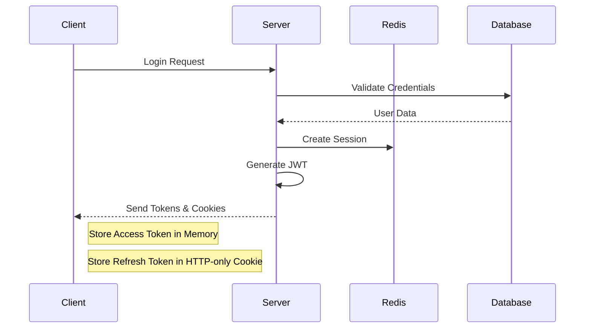

# SportSync

SportSync is a modern sports event management and scheduling platform that helps organize and coordinate sports activities, matches, and tournaments.

## Features

- User authentication and authorization
- Event scheduling and management
- Team creation and management
- Real-time notifications
- Tournament brackets
- Score tracking

## Authentication Flow

### JWT (JSON Web Token) Authentication

SportSync uses JWT-based authentication to secure API endpoints and manage user sessions. Here's how it works:

1. **Login Flow**:
   - User submits credentials (email/password)
   - Server validates credentials
   - Server generates JWT containing user information and permissions
   - Token is sent back to client
   - Client stores token in local storage/memory

2. **Token Structure**:
   ```
   header.payload.signature
   ```
   - Header: Algorithm & token type
   - Payload: User data & claims
   - Signature: Encrypted verification segment

3. **Request Flow**:
   - Client includes JWT in Authorization header
   - Server validates token signature
   - Server checks token expiration
   - If valid, grants access to protected resources

### Session Management

SportSync implements a hybrid session management approach:

1. **Server-side Sessions**:
   - Session ID stored in database
   - Contains user state and preferences
   - Handles sensitive operations

2. **Cookie Management**:
   - HTTP-only cookies for enhanced security
   - Secure flag enabled for HTTPS
   - SameSite policy implementation
   - CSRF protection

3. **Security Measures**:
   - Token refresh mechanism
   - Session timeout
   - Concurrent session handling
   - IP-based session validation

## Installation

## Rubric 2: Detailed Authentication & Session Management

### 2.1 JWT (JSON Web Token) Deep Dive

#### 2.1.1 Token Generation
```javascript
// Example JWT structure
{
  "header": {
    "alg": "HS256",
    "typ": "JWT"
  },
  "payload": {
    "userId": "123456",
    "role": "admin",
    "iat": 1516239022,
    "exp": 1516242622
  },
  "signature": "HMACSHA256(base64UrlEncode(header) + '.' + base64UrlEncode(payload), secret)"
}
```

#### 2.1.2 JWT Implementation Details
- **Token Lifetime**: 1 hour default expiration
- **Refresh Token**: 7 days validity
- **Token Storage**: 
  - Access token: Memory (React Context)
  - Refresh token: HTTP-only cookie

#### 2.1.3 Security Measures
- Payload encryption for sensitive data
- Token blacklisting for logged-out tokens
- Rate limiting on token generation
- JTI (JWT ID) for token revocation

### 2.2 Session Management Architecture

#### 2.2.1 Server-Side Sessions
```javascript
// Example session structure
{
  "sessionId": "sess:12345",
  "userData": {
    "userId": "user123",
    "lastActive": "2024-03-20T10:00:00Z",
    "deviceInfo": "Mozilla/5.0...",
    "ipAddress": "192.168.1.1"
  },
  "expiresAt": "2024-03-21T10:00:00Z"
}
```

#### 2.2.2 Session Storage
- **Primary Storage**: Redis
- **Backup Storage**: PostgreSQL
- **Session Duration**: 24 hours
- **Cleanup Policy**: Automatic purge after 48 hours

#### 2.2.3 Session Security
- Session rotation on privilege change
- Absolute timeout: 24 hours
- Idle timeout: 30 minutes
- Geographic location validation

### 2.3 Cookie Management System

#### 2.3.1 Cookie Configuration
```javascript
// Cookie settings
{
  "httpOnly": true,
  "secure": true,
  "sameSite": "strict",
  "domain": ".sportsync.com",
  "path": "/",
  "maxAge": 86400000
}
```

#### 2.3.2 Cookie Types and Usage
1. **Authentication Cookies**
   - RefreshToken cookie (HTTP-only)
   - Session identifier
   - CSRF token

2. **Preference Cookies**
   - User settings
   - Theme preferences
   - Language selection

3. **State Management Cookies**
   - Shopping cart data
   - Last visited page
   - Temporary form data

#### 2.3.3 Security Implementation
- **CSRF Protection**:
  ```javascript
  // CSRF token generation
  const csrfToken = crypto.randomBytes(32).toString('hex');
  // Token verification middleware
  app.use(csrf({
    cookie: {
      httpOnly: true,
      secure: process.env.NODE_ENV === 'production'
    }
  }));
  ```

- **Cookie Security Headers**:
  ```javascript
  // Security headers configuration
  {
    "Strict-Transport-Security": "max-age=31536000; includeSubDomains",
    "X-Content-Type-Options": "nosniff",
    "X-Frame-Options": "SAMEORIGIN",
    "X-XSS-Protection": "1; mode=block"
  }
  ```

### 2.4 Authentication Flow Sequence



### 2.5 Error Handling and Recovery

#### 2.5.1 Token Errors
- Invalid signature handling
- Expired token refresh process
- Malformed token detection

#### 2.5.2 Session Errors
- Session timeout recovery
- Concurrent session conflict resolution
- Session synchronization across devices

#### 2.5.3 Cookie Errors
- Missing cookie recovery
- Corrupted cookie handling
- Cross-domain cookie issues

### 2.6 Performance Considerations

- JWT size optimization
- Session storage scaling
- Cookie payload minimization
- Caching strategies
- Database query optimization

// Rest of the README content continues...